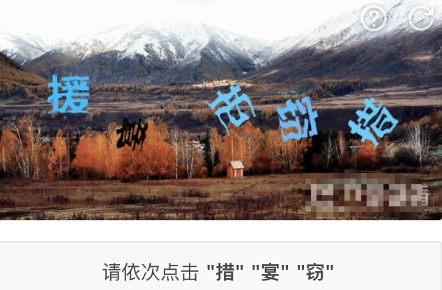
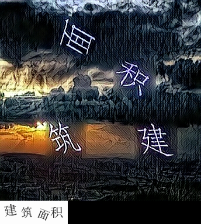
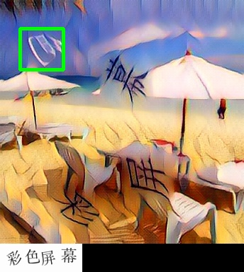

仓库：[gsxt_captcha](https://github.com/worldwonderer/gsxt_captcha)，参考[破解含语序问题的点击验证码](https://runninggump.github.io/2018/11/19/%E7%A0%B4%E8%A7%A3%E5%90%AB%E8%AF%AD%E5%BA%8F%E9%97%AE%E9%A2%98%E7%9A%84%E7%82%B9%E5%87%BB%E9%AA%8C%E8%AF%81%E7%A0%81/)，修复了一些bug，并上传了已训练好的某验文字定位模型。

### 文字点选验证码形态



某易易盾



某验

其中某验的一款验证码还要求按语义顺序点选文字。

### 解决思路

1. 文字定位
2. 文字识别
3. 语序识别
4. 轨迹模拟

本文作为上篇，先解决文字定位问题。

### 文字定位

采用darknet深度学习框架，YOLO算法。具体原理，后续再做整理。

#### 环境准备
硬件：4核/20GB内存/Tesla P4

软件：Ubuntu 18.04/CUDA 10.0/CUDNN 7.6/OpenCV（可选）/darknet

没错，就是在腾讯云上购买的GPU服务器，镜像选择了Ubuntu 18.04带CUDA。

如果服务器上没有CUDA环境，可参考该脚本安装 [cuda_10.0_installation_on_Ubuntu_18.04](https://gist.github.com/Mahedi-61/2a2f1579d4271717d421065168ce6a73)。

darknet安装参考 [darknet install](https://pjreddie.com/darknet/install/)，我选择了AlexeyAB改进的[darknet](https://github.com/AlexeyAB/darknet)，在`Makefile`中，修改以下选项。
```
GPU=1                                                                                
CUDNN=1                                                                        
CUDNN_HALF=1  # 是否开启取决于你的GPU是否支持混合精度，开启可加速训练                                                                       
OPENCV=1  # 如果你安装了OpenCV，可以开启
```

#### 数据集准备
首先下载验证码图片。
```shell script
git clone 'https://github.com/worldwonderer/gsxt_captcha.git'
cd gsxt_captcha/jiyan
mkdir data/crawled_img
python3 get_pic.py  # 需要chrome
```

标注工具 [labelImg](https://github.com/tzutalin/labelImg)，选择YOLO模式，在View选项卡中可开启单一类别和自动保存，提交效率。标注800张图片作为训练集。

#### 训练

回到`gsxt_captcha`根目录，将训练集放在`jiyan/data/train/`，验证集放在`jiyan/data/valid`。
```
-rwxr-xr-x  1 ****  ****    22K  2  1 11:12 1530942834.jpg
-rw-r--r--  1 ****  ****   371B  2  1 11:12 1530942834.txt
-rwxr-xr-x  1 ****  ****    17K  2  1 11:12 1530942839.jpg
-rw-r--r--  1 ****  ****   277B  2  1 11:12 1530942839.txt
```
接着执行，生成train.txt，valid.txt。
```shell script
cd jiyan/data
sh gen_txt.sh
```
回到根目录，开始训练。
```shell script
cd ../../
pwd  # gsxt_captcha
sh yolo_train.sh
```
2000轮训练后，average loss 0.3，我停止了训练，模型保存在`jiyan/backup`里，跑一轮测试。
```
pwd  # gsxt_captcha
sh yolo_test.sh
```
测试结果在`results/comp4_det_test_hanzi.txt`，txt中的列分别为：文件名，置信度，x1，y1，x2，y2。来用OpenCV画个框看看。
```python
import cv2


with open('results/comp4_det_test_hanzi.txt', 'r') as f:
    for line in f:
        vals = line.strip().split()
        fname, p, x1, y1, x2, y2 = vals
        fname = 'jiyan/data/valid/' + fname + '.jpg'
        x1 = int(float(x1))
        x2 = int(float(x2))
        y1 = int(float(y1))
        y2 = int(float(y2))
        p = float(p)
        img = cv2.imread(fname)
        # 画矩形框
        if p > 0.5:  # 只有置信度大于50%时框出目标
            cv2.rectangle(img, (x1,y1), (x2,y2), (0,255,0), 4)
            cv2.imwrite(fname+'.{}.jpg'.format(p), img)
```



效果图

全文完～