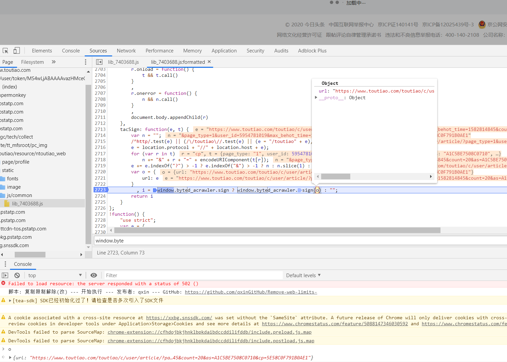

### 背景

目前JS加密参数的使用越来越广泛且复杂，同时针对主流web自动化测试工具selenium和puppeteer的检测也已成熟且代码隐蔽。



以某条为例，14日更新的_signature参数较以往有很大的升级。加密参数的位置通过断点调试不难发现是`window.byted_acrawler.sign`，参数是`{url: "https://www.xxxxxxxx.com/xxxxxxxx/c/user/article/?pa…45&count=20&as=A1C5BE7508C0710&cp=5E58C0F791B0AE1"}`。但是想将该函数抽取出来需要做很多额外的工作。

但是如果利用浏览器环境，可以直接调用该函数。最直接的方法是使用selenium开启Chrome执行`driver.execute_script('return window.byted_acrawler.sign({url: "https://www.xxxxxxxx.com/xxxxxxxx/c/user/article/?pa…45&count=20&as=A1C5BE7508C0710&cp=5E58C0F791B0AE1"})')`。但是很神奇的发现，只要使用selenium，Chrome打开网站并不会加载feed流，生成的_signature也无效。

很明显，某条对selenium等自动化测试工具做了检测。隐去部分selenium特征后，feed流能正常加载，但是在执行JS后，又不能加载feed流，_signature无效。

这里不做JS的分析，提出另一种解决方式，websocket。应对JS检测selenium，主流的做法是通过中间人攻击的方式，修改目标网站的JS，但是定位代码耗时耗力。其实换一种角度，我们也可以通过加入JS，通过websocket实现浏览器和服务器的通信，服务器将加密函数参数传到浏览器，浏览器加载js后返回给服务器，实现完全不用selenium也可以操作浏览器。

下边给出实战代码，首先来看mitmproxy，中间人攻击的相关代码，使用`mitmdump  -p 8080 -s tt.py`开启代理服务器。

```python
# tt.py
import mitmproxy.http

inject = """var ws = new WebSocket('ws://localhost:8000/');
ws.onopen= function() {
    ws.send('browser started')
};
ws.onmessage= function(evt) {
    ws.send(window.byted_acrawler.sign({url: evt.data}));
};
"""

class TT(object):
    def response(self, flow: mitmproxy.http.HTTPFlow):
        if 'acrawler.js' in flow.request.url:
                flow.response.text = inject + flow.response.text
                print('inject success')


addons = [
    TT()
]
```

另外在服务端，起个websocket服务

```python
import asyncio
import websockets

async def send(websocket, path):
    while True:
        await websocket.send("https://www.xxxxxxxx.com/xxxxxxxx/c/user/article/?page_type=1&user_id=5954781019&max_behot_time=1582778326&count=20&as=A1E58E3517D5422&cp=5E5745D432429E1")
        await asyncio.sleep(3)
        print("url sent")

asyncio.get_event_loop().run_until_complete(
    websockets.serve(send, 'localhost', 8000))
asyncio.get_event_loop().run_forever()
```

最后启动chrome浏览器即可

```shell
./Chromium http://www.xxxxxxxx.com --proxy-server=127.0.0.1:8080 --ignore-certificate-errors
```

浏览器启动后会执行注入JS，与服务器建立连接。接收到server传入的参数，计算出加密参数后，返回给server。

另外，有些情况下加密函数不是全局函数，如某瓜视频。应对方式也很简单，在加密函数出现的位置注入websocket连接，即可获取到加密函数和执行环境。

全文完~