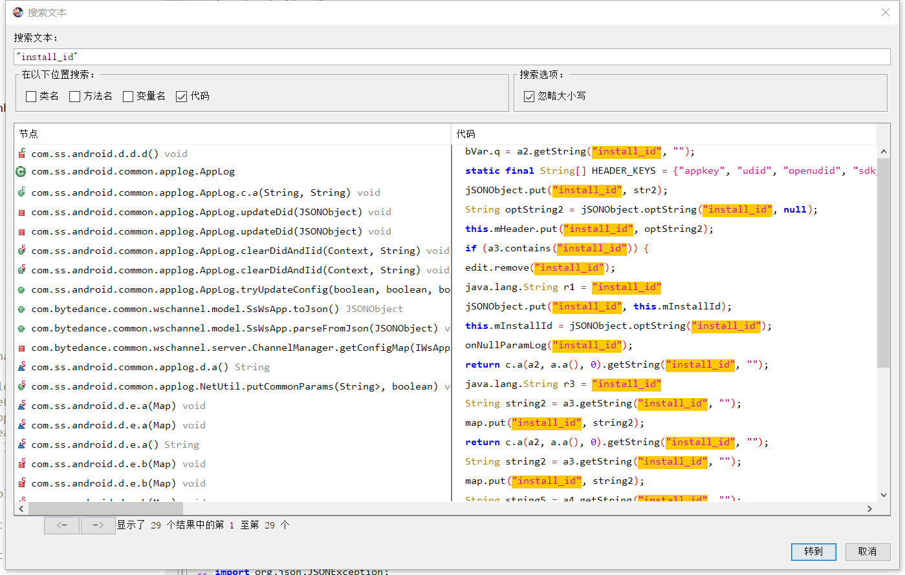
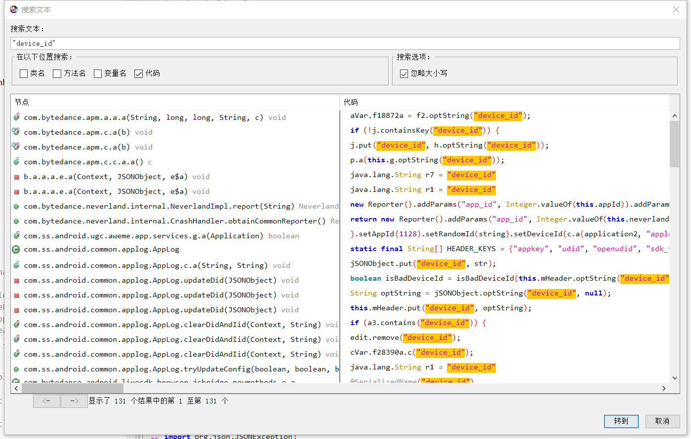
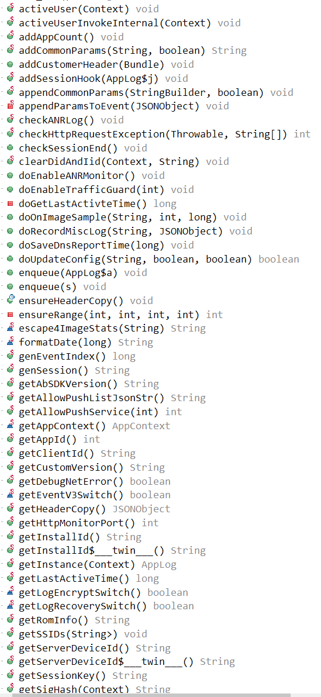
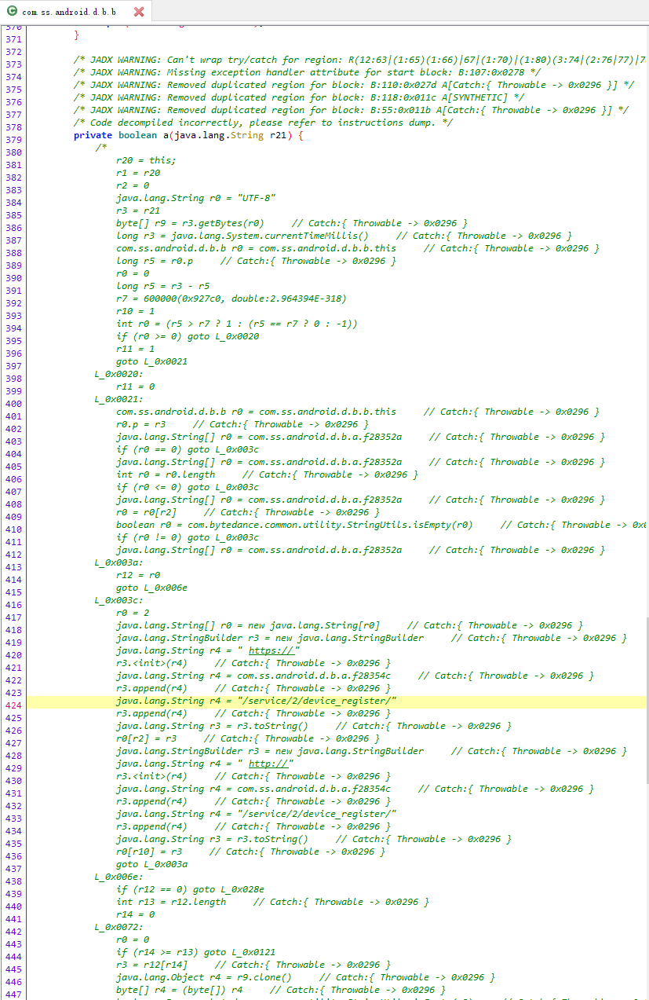
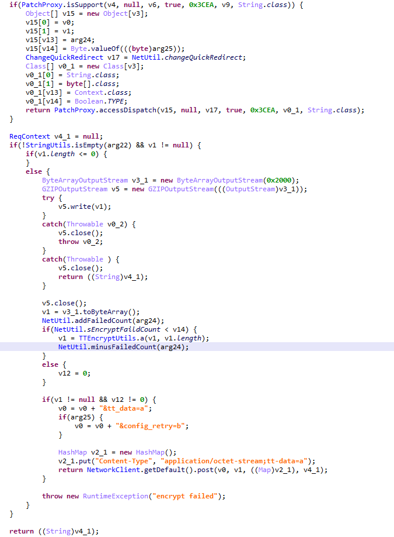

## 背景

某音的爬取，除了逆向协议以外，还有个设备注册的关键点。协议的逆向已经有很多前辈分享，也比较简单，抛开不谈。这篇文章主要讲讲某音的设备注册和激活。

## 设备注册

查阅资料，设备ID注册主要是有device_id和install_id（iid）。注册的URL：`http://log.******.com/service/2/device_register/`。

先根据device_id和install_id来做搜索。某音没有做加固，用Jadx直接打开，同时搜索device_id和install_id可以发现主要代码区段在com.**.android.common.applog.AppLog包中。

确实很可疑，有很多设备ID和设备相关的参数和方法，但是没有设备注册相关的代码，先放着不谈。

接着直接搜索device_register吧，出来的结果并不多，发现Jadx无法正常解析，虽然看指令也能看出大概，这里就是设备注册的具体逻辑了。

使用JEB打开后是这个效果。

总体和网上的资料一致，收集各种设备信息，并压缩和加密，看到这其实发现设备ID的获取并不困难。

这里推荐这个项目[device_register](https://github.com/coder-fly/douyin_device_register)，能够直接生成device_id，其中加密函数调用采用了unidbg。

## 设备激活

不过上述项目的作者在README中也提到，通过该方式获取到的device_id和iid去访问接口，会得到空的响应。原作者猜测是有相关的激活请求，测试下来确实如此。所以本文的重点是分享一种欺骗打点日志，实现设备ID重激活的思路。

回到之前最开始看到的AppLog类，里边有很多记录用户行为并上传打点日志的情况，而这些日志里边会包含device_id和iid。于是猜测到会不会是这些打点日志影响了device_id的有效性。如果我们把生成的device_id注入到真实的手机App中，那么打开App会按我们注入的device_id来打点，是不是就能洗白了？

查阅资料发现，如果将AppLog类中还有一个控制打点日志body是否需要加密的方法，找到名字对应是getLogEncryptSwitch，先将其改为false。之后发现抓包确实都显示明文了，可以发现body中header字段带上了设备信息，追溯下来其实就是mheader这个字段，所以首先要把device_id和iid注入到这个mheader中。

注入完成之后抓包发现，URL中的device_id和iid还没有变，不过这里边的参数修改也比较容易，找到统一加请求参数的类com.**.android.d.e将device_id和iid扔进去即可。

最后看一下device_id的存储位置。回到AppLog的getServerDeviceId和getInstallId方法，可以看到他们其实最终是从SharedPreferences取出的数据。所以除了要注入所有的获取device_id和iid的方法，删除SharedPreferences来清除原有的device_id和iid会更加保险。

做完上述的所有操作后，重新打开App抓包可以发现，所有的打点日志都用到了我们新注入的device_id，并且device_register接口返回了新install_id，经测试可以在所有接口上使用。

## 总结

除了通讯协议逆向，设备ID的生成和风控规避尤为重要。之前在文章中也提到，不推荐在高日活App中纯使用协议来做抓取，特别是必须要登录的情况下（设备ID其实也可以被视为一种特殊的账户）。在大数据和风控渐渐普及的今天，借助手机的环境，上传一些真实行为日志，很有必要，本篇就是很典型的案例。