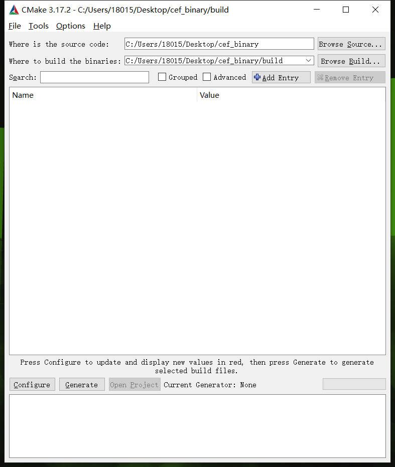
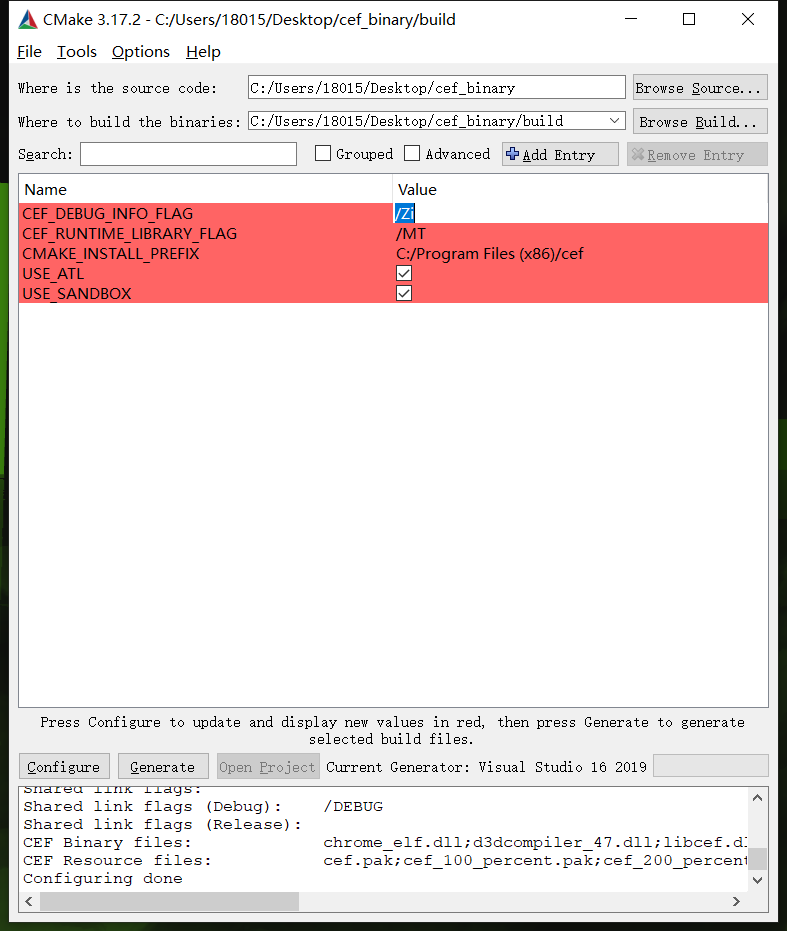
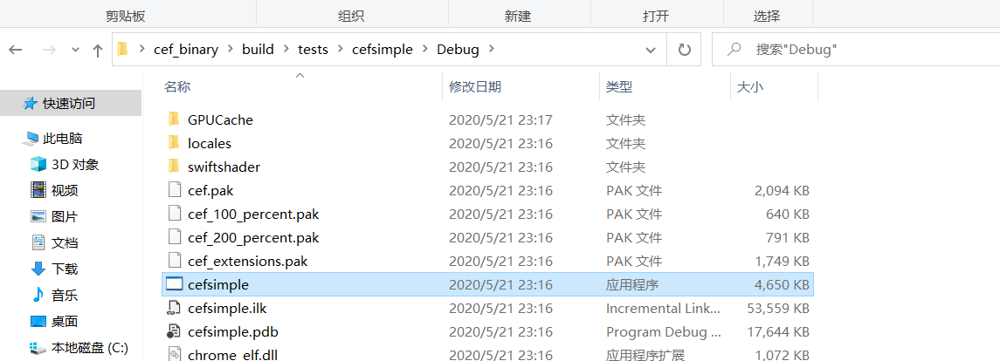
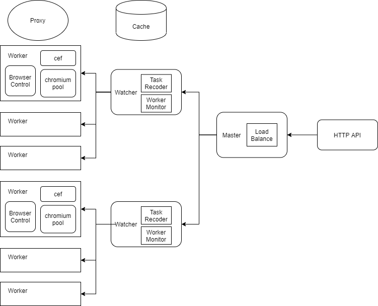

## 背景

在JS动态加载遍地都是的现在，通用爬虫系统离不开强大的浏览器集群。市面上有诸多关于selenium和puppeteer操纵浏览器进行爬取的教程。但是随着反爬技术的发展，selenium的特征很容易被检测，这里有一些相关的讨论：[Can a website detect when you are using selenium with chromedriver?
](https://stackoverflow.com/questions/33225947/can-a-website-detect-when-you-are-using-selenium-with-chromedriver)。当然清除selenium特征，或者篡改检测的代码也是一种应对策略。除了自动化测试流派，是否还有其他操纵浏览器的方式呢？本文提出基于CEF（Chromium Embedded Framework）和Chromium，定制一套专业的爬虫浏览器环境，并工程化为浏览器集群。

## Chromium
反爬技术中的浏览器指纹，即获取浏览器具有辨识度的独一无二的特征，计算出值来作为浏览器的标识，正在被广泛使用。[(Cross-)Browser Fingerprinting via OS and Hardware Level Features](http://yinzhicao.org/TrackingFree/crossbrowsertracking_NDSS17.pdf) 这篇论文讲述了一些通过操作系统和硬件层面对浏览器信息进行收集和比对的方式。

Chromium是一个开源浏览器项目，相比Chrome浏览器，其开源属性让我们有了修改和定制浏览器的机会，以规避基于浏览器指纹的反爬，增加专属于爬虫的功能。

## CEF

CEF是支持在其他应用中嵌入Chromium浏览器的框架，提供了丰富的接口以操纵浏览器。这里主要介绍下CEF的编译和二次开发。

### 编译
注：以下编译是在Windows x64环境下进行的。

推荐使用已编译好内核的[libcef](http://opensource.spotify.com/cefbuilds/index.html#windows64_builds)，选择Standard Distribution。另外，还需要下载一款跨平台的编译辅助工具[CMake](https://cmake.org/download/)，选择Windows win64-x64 Installer。最后当然还得下载个Visual Studio 2019，需要安装的组件有Windows 10 SDK、MSBuild、用于Windows的C++ CMake工具。

准备完这些之后，先打开cmake-gui，where is source code选择cef_binary所在的文件夹，where to build the binaries在cef_binary里边新建一个build目录，总体如下图所示。

点击Configure，按下图配置，并点击Finish。

正常会出现下图的提示。

接着点击Generate即可。

在build文件夹，用Visual Studio打开cef.sln文件。

接下来我们编译最简单的示例代码cefsimple。首先将cefsimple设为启动项目，然后在菜单栏生成里边点击生成cefsimple。

不出意外就能在`cef_binary\build\tests\cefsimple\Debug`文件夹里找到编译完的cefsimple。

## 浏览器集群

