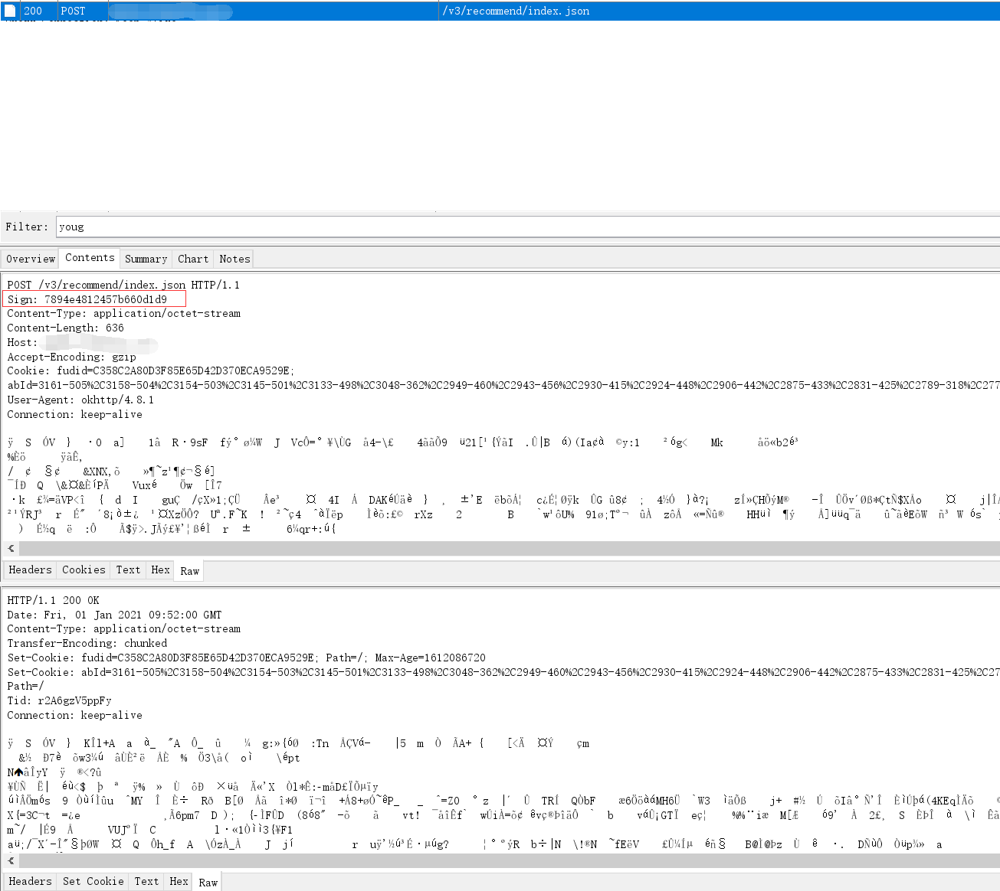
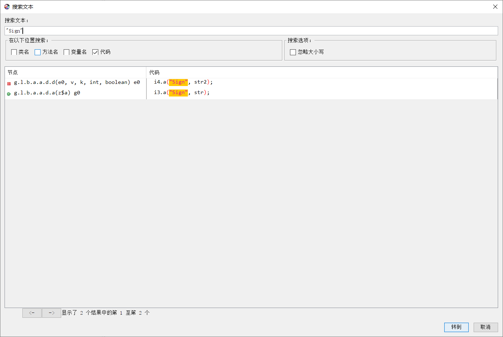
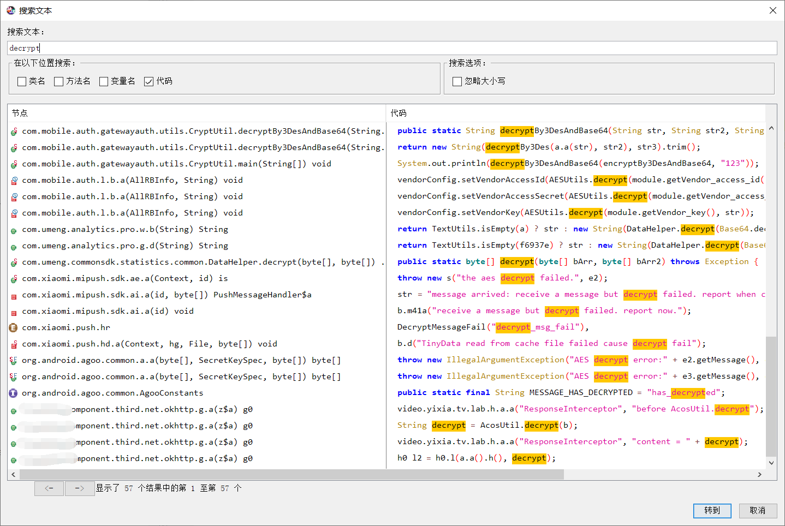
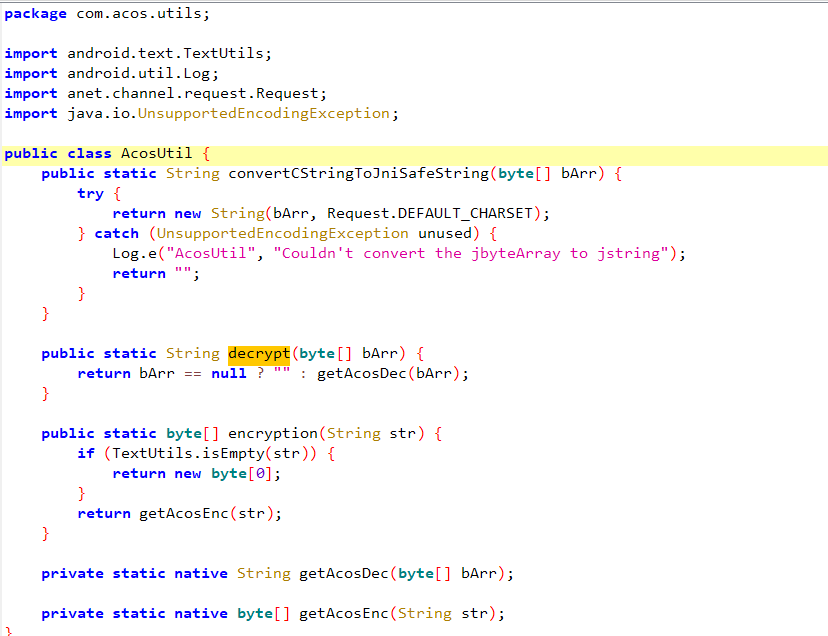
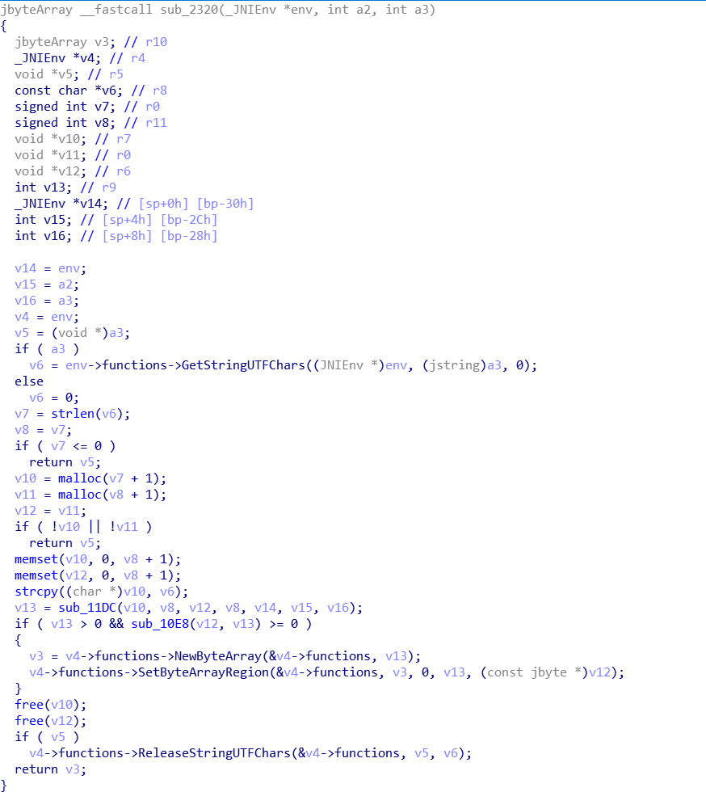
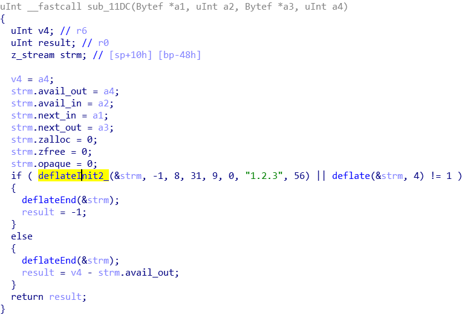

## 背景

最近一款搬运Youtube视频的App在小圈子里火了起来，通常新App的防护是比较差的，逆向难度低。本来是不适合用来水博客的，但既然简单那就可以玩点花样，试试来用[AndroidNativeEmu](https://github.com/AeonLucid/AndroidNativeEmu)实现加解密算法的调用。

## 抓包



抓包过程很顺利，可以看到headers中有Sign参数，request和response的body部分均被加密

## Java层

用Jadx打开，直接搜索"Sign"，出来两条，代码位置也都很接近。追踪下去可以发现是在Java层实现的Sign计算，简单的做了MD5加盐，就不提了



接着看一下body加密的实现，一般习惯直接搜索一下decrypt encrypt decode encode这样的关键词，直接就定位到了



简单看了下和某红书相同的套路，用了okhttp中的interceptor拦截器，接着追踪下加解密的具体实现



加解密类如图，方法的实现放在了Native层

## Native层

用IDA打开，先看一下导出函数，没有Java_开头的函数，说明可能是在JNI_OnLoad动态注册的


打开JNI_OnLoad，导入jni.h解析一下JNI的相关变量，效果如图


发现果然是注册了两个native函数，进入off_4004看一下


decrypt方法在2164，encrypt方法在2320。decrypt方法IDA识别有些问题，虽然修复不是本篇的主题，简单说一句就是从内存中dump出一份对照。就先看一下encrypt，即sub_2320

同样，再次解析JNI的相关变量，解析完如图



发现关键函数sub_11DC和sub_10E8



简单分析了一下，sub_11DC主要是用了deflate方法，google了一下发现是libz.so提供的压缩算法。sub_10E8是一堆位运算

静态分析到这里基本也就结束了，一般接下来就动态调试，调出位运算

## AndroidNativeEmu使用

铺垫了这么多，本篇的重点终于来了，AndroidNativeEmu项目介绍参考README，不赘述

观察了下sample里边的例子，example_jni.py比较符合我们，照着定义一下AcosUtil，加载一下上边分析的libacos_util.so加解密动态库，这时候代码大概长这样

```python
import logging
import posixpath
import sys

from unicorn import UcError, UC_HOOK_MEM_UNMAPPED, UC_HOOK_CODE, UC_HOOK_MEM_READ, UC_HOOK_MEM_WRITE
from unicorn.arm_const import *

from androidemu.emulator import Emulator
from androidemu.java.java_class_def import JavaClassDef
from androidemu.java.java_method_def import java_method_def

import debug_utils


# Create java class.
class AcosUtil(metaclass=JavaClassDef, jvm_name='com/acos/utils/AcosUtil'):

    def __init__(self):
        pass

    @java_method_def(name='getAcosEnc', signature='(Ljava/lang/String;)[B', native=True)
    def get_acos_enc(self, mu):
        pass

    @java_method_def(name='getAcosDec', signature='([B)Ljava/lang/String;', native=True)
    def get_acos_dec(self, mu):
        pass

    def test(self):
        pass


# Configure logging
logging.basicConfig(
    stream=sys.stdout,
    level=logging.DEBUG,
    format="%(asctime)s %(levelname)7s %(name)34s | %(message)s"
)

logger = logging.getLogger(__name__)

# Initialize emulator
emulator = Emulator(
    vfp_inst_set=True,
    vfs_root=posixpath.join(posixpath.dirname(__file__), "vfs")
)

# emulator.mu.hook_add(UC_HOOK_CODE, debug_utils.hook_code)
emulator.mu.hook_add(UC_HOOK_MEM_UNMAPPED, debug_utils.hook_unmapped)

# Register Java class.
emulator.java_classloader.add_class(AcosUtil)

# Load all libraries.
emulator.load_library("example_binaries/libdl.so")
emulator.load_library("example_binaries/libc.so")
emulator.load_library("example_binaries/libstdc++.so")
emulator.load_library("example_binaries/libm.so")
lib_module = emulator.load_library("example_binaries/libacos_util.so")

# Show loaded modules.
logger.info("Loaded modules:")

for module in emulator.modules:
    logger.info("=> 0x%08x - %s" % (module.base, module.filename))

# Debug
# emulator.mu.hook_add(UC_HOOK_CODE, debug_utils.hook_code)
# emulator.mu.hook_add(UC_HOOK_MEM_UNMAPPED, debug_utils.hook_unmapped)
# emulator.mu.hook_add(UC_HOOK_MEM_WRITE, debug_utils.hook_mem_write)
# emulator.mu.hook_add(UC_HOOK_MEM_READ, debug_utils.hook_mem_read)

try:
    # Run JNI_OnLoad.
    #   JNI_OnLoad will call 'RegisterNatives'.
    emulator.call_symbol(lib_module, 'JNI_OnLoad', emulator.java_vm.address_ptr, 0x00)

    # Do native stuff.
    acos_util = AcosUtil()

    result = acos_util.get_acos_enc(emulator, 'fuckkkkkkkkkkkkkkkkkkkkkkkkkkkkkkk')
    result_hex = ''.join(['%02x' % b for b in result])
    print(result_hex)

    result = acos_util.get_acos_dec(emulator, bytearray(bytes.fromhex(result_hex)))
    print(result)

except UcError as e:
    print("Exit at %x" % emulator.mu.reg_read(UC_ARM_REG_PC))
    raise
```

试着运行了一下报错，`unicorn.unicorn.UcError: Invalid memory fetch (UC_ERR_FETCH_UNMAPPED)`。好吧，还记得上边deflate函数吗，libz.so我们也得加载上。

这里有个小技巧，`cat /proc/<pid>/maps`可以看到进程加载的动态库，然后直接`adb pull /system/lib/libz.so`就能拿到libz.so文件了

加上`emulator.load_library("example_binaries/libz.so")`

接着运行，还是报错`RuntimeError: Could not find static method ('convertCStringToJniSafeString', '([B)Ljava/lang/String;') in class com/acos/utils/AcosUtil.`

嗯，native层调用了AcosUtil中的静态方法convertCStringToJniSafeString，我们照着Java代码补充上

```python
class AcosUtil(metaclass=JavaClassDef, jvm_name='com/acos/utils/AcosUtil'):

    def __init__(self):
        pass

    @java_method_def(name='getAcosEnc', signature='(Ljava/lang/String;)[B', native=True)
    def get_acos_enc(self, mu):
        pass

    @java_method_def(name='getAcosDec', signature='([B)Ljava/lang/String;', native=True)
    def get_acos_dec(self, mu):
        pass

    @java_method_def(name='convertCStringToJniSafeString', signature='([B)Ljava/lang/String;', native=False, args_list=['jbyteArray'])
    def convert_cstring_to_jni_safe_string(self, arr):
        return arr.value.decode()

    def test(self):
        pass
```

再次运行，这次虽然还是报错了，但是！加密是成功运行到了的，打印出了结果

```
2021-01-01 19:09:36,722   DEBUG            androidemu.java.java_vm | java_vm: 0x01000056
2021-01-01 19:09:36,722   DEBUG            androidemu.java.java_vm | env: 0x000fffec
2021-01-01 19:09:36,722   DEBUG            androidemu.java.java_vm | version: 0x00010004
2021-01-01 19:09:36,722   DEBUG            androidemu.java.java_vm | JavaVM->GetENV() was called!
2021-01-01 19:09:36,722   DEBUG            androidemu.java.jni_env | JNIEnv->FindClass(com/acos/utils/AcosUtil) was called
2021-01-01 19:09:36,723   DEBUG            androidemu.java.jni_env | JNIEnv->RegisterNatives(1, 0xcbcb5004, 2) was called
2021-01-01 19:09:36,723   DEBUG     androidemu.java.java_class_def | Registered native function ('getAcosDec', '([B)Ljava/lang/String;') to AcosUtil.get_acos_dec
2021-01-01 19:09:36,723   DEBUG     androidemu.java.java_class_def | Registered native function ('getAcosEnc', '(Ljava/lang/String;)[B') to AcosUtil.get_acos_enc
2021-01-01 19:09:36,724   DEBUG            androidemu.java.jni_env | JNIEnv->GetStringUtfChars(1, 0) was called
2021-01-01 19:09:36,724   DEBUG            androidemu.java.jni_env | => fuckkkkkkkkkkkkkkkkkkkkkkkkkkkkkkk
2021-01-01 19:09:36,731   DEBUG    androidemu.cpu.syscall_handlers | Executing syscall mmap2(00000000, 00080000, 00000003, 00004022, ffffffff, 00000000) at 0xcbc1abc4
2021-01-01 19:09:36,731   DEBUG    androidemu.cpu.syscall_handlers | Executing syscall madvise(20180000, 00080000, 0000000c) at 0xcbc1b78c
2021-01-01 19:09:36,732   DEBUG    androidemu.cpu.syscall_handlers | Executing syscall prctl(53564d41, 00000000, 20180000, 00080000, cbc42068) at 0xcbc1b97c
2021-01-01 19:09:36,742   DEBUG    androidemu.cpu.syscall_handlers | Executing syscall madvise(20183000, 00021000, 00000004) at 0xcbc1b78c
2021-01-01 19:09:36,743   DEBUG    androidemu.cpu.syscall_handlers | Executing syscall madvise(20147000, 00021000, 00000004) at 0xcbc1b78c
2021-01-01 19:09:36,745   DEBUG            androidemu.java.jni_env | JNIEnv->NewByteArray(25) was called
2021-01-01 19:09:36,745   DEBUG            androidemu.java.jni_env | JNIEnv->SetByteArrayRegion was called
2021-01-01 19:09:36,746   DEBUG            androidemu.java.jni_env | JNIEnv->ReleaseStringUTFChars(1, 20001000) was called
ff05539dd356137d94b769fa6dfc8328296f11377b30e2abb2
2021-01-01 19:12:53,685   DEBUG            androidemu.java.jni_env | JNIEnv->GetArrayLength(1) was called
2021-01-01 19:12:53,693   DEBUG            androidemu.java.jni_env | JNIEnv->FindClass(com/acos/utils/AcosUtil) was called
2021-01-01 19:12:53,693   DEBUG            androidemu.java.jni_env | JNIEnv->GetStaticMethodId(2, convertCStringToJniSafeString, ([B)Ljava/lang/String;) was called
2021-01-01 19:12:53,694   DEBUG            androidemu.java.jni_env | JNIEnv->NewByteArray(34) was called
2021-01-01 19:12:53,694   DEBUG            androidemu.java.jni_env | JNIEnv->SetByteArrayRegion was called
Traceback (most recent call last):
  File "_ctypes/callbacks.c", line 234, in 'calling callback function'
  File "/home/pite/.local/lib/python3.6/site-packages/unicorn/unicorn.py", line 479, in _hookcode_cb
    cb(self, address, size, data)
  File "/mnt/c/Users/18015/Desktop/reverse/AndroidNativeEmu/samples/androidemu/hooker.py", line 97, in _hook
    hook_func(self._emu)
  File "/mnt/c/Users/18015/Desktop/reverse/AndroidNativeEmu/samples/androidemu/java/helpers/native_method.py", line 112, in native_method_wrapper
    result = func(argv[0], mu, *native_args)
  File "/mnt/c/Users/18015/Desktop/reverse/AndroidNativeEmu/samples/androidemu/java/jni_env.py", line 1120, in call_static_object_method
    raise NotImplementedError()
NotImplementedError
```

这次的报错是说我们没有实现jni_env.py中的call_static_object_method方法。观察了下源码，原作者是有实现call_static_object_method_v方法的，主要差别就是call_static_object_method接收的参数数量不确定

但针对我们这个case来说，convertCStringToJniSafeString参数数量和类型是定的，也就是bytearray，我们照着call_static_object_method_v补充上代码
```python
    @native_method
    def call_static_object_method(self, mu, env, clazz_idx, method_id, array):
        """case only"""
        clazz = self.get_reference(clazz_idx)

        if not isinstance(clazz, jclass):
            raise ValueError('Expected a jclass.')

        method = clazz.value.find_method_by_id(method_id)

        if method is None:
            # TODO: Proper Java error?
            raise RuntimeError("Could not find method %d in class %s by id." % (method_id, clazz.value.jvm_name))

        logger.debug("JNIEnv->CallStaticObjectMethod(%s, %s <%s>, 0x%x) was called" % (
            clazz.value.jvm_name,
            method.name,
            method.signature, array))

        # Parse arguments.
        constructor_args = self.read_args_v(mu, array, method.args_list)
        return method.func(self._emu, *constructor_args)
```

运行还是报错
```
Traceback (most recent call last):
  File "_ctypes/callbacks.c", line 234, in 'calling callback function'
  File "/home/pite/.local/lib/python3.6/site-packages/unicorn/unicorn.py", line 479, in _hookcode_cb
    cb(self, address, size, data)
  File "/mnt/c/Users/18015/Desktop/reverse/AndroidNativeEmu/samples/androidemu/hooker.py", line 97, in _hook
    hook_func(self._emu)
  File "/mnt/c/Users/18015/Desktop/reverse/AndroidNativeEmu/samples/androidemu/java/helpers/native_method.py", line 112, in native_method_wrapper
    result = func(argv[0], mu, *native_args)
  File "/mnt/c/Users/18015/Desktop/reverse/AndroidNativeEmu/samples/androidemu/java/jni_env.py", line 1138, in call_static_object_method
    return method.func(self._emu, *constructor_args)
  File "/mnt/c/Users/18015/Desktop/reverse/AndroidNativeEmu/samples/androidemu/java/java_method_def.py", line 28, in normal_wrapper
    result = func(*args, **kwargs)
  File "example_youguo_init.py", line 31, in convert_cstring_to_jni_safe_string
    return arr.value.decode()
AttributeError: 'NoneType' object has no attribute 'value'
```

为什么constructor_args是None呢？

分析了一下，主要是`read_args_v`这个方法，我们传入的array是reference_table中的idx值3，不是内存指针地址
```python
            elif arg_name == 'jbyteArray':
                ref = int.from_bytes(mu.mem_read(args_ptr, 4), byteorder='little')
                result.append(self.get_reference(ref))
                args_ptr = args_ptr + 4
```
所以这里我们无法获取到jbyteArray，我们打个补丁进去
```python
            elif arg_name == 'jbyteArrayLocal':  # case only
                result.append(self.get_reference(args_ptr))
```

```python
    @java_method_def(name='convertCStringToJniSafeString', signature='([B)Ljava/lang/String;', native=False, args_list=['jbyteArrayLocal'])
    def convert_cstring_to_jni_safe_string(self, arr):
        return arr.value.decode()
```

再次运行
```
2021-01-01 19:38:34,842    INFO                           __main__ | Loaded modules:
2021-01-01 19:38:34,842    INFO                           __main__ | => 0xcbbcb000 - example_binaries/libdl.so
2021-01-01 19:38:34,842    INFO                           __main__ | => 0xcbbd1000 - example_binaries/libc.so
2021-01-01 19:38:34,842    INFO                           __main__ | => 0xcbc6c000 - example_binaries/libvendorconn.so
2021-01-01 19:38:34,842    INFO                           __main__ | => 0xcbc6f000 - example_binaries/libstdc++.so
2021-01-01 19:38:34,842    INFO                           __main__ | => 0xcbc75000 - example_binaries/libm.so
2021-01-01 19:38:34,843    INFO                           __main__ | => 0xcbc98000 - example_binaries/libz.so
2021-01-01 19:38:34,843    INFO                           __main__ | => 0xcbcb1000 - example_binaries/libacos_util.so
2021-01-01 19:38:34,843   DEBUG            androidemu.java.java_vm | java_vm: 0x01000056
2021-01-01 19:38:34,843   DEBUG            androidemu.java.java_vm | env: 0x000fffec
2021-01-01 19:38:34,843   DEBUG            androidemu.java.java_vm | version: 0x00010004
2021-01-01 19:38:34,844   DEBUG            androidemu.java.java_vm | JavaVM->GetENV() was called!
2021-01-01 19:38:34,844   DEBUG            androidemu.java.jni_env | JNIEnv->FindClass(com/acos/utils/AcosUtil) was called
2021-01-01 19:38:34,844   DEBUG            androidemu.java.jni_env | JNIEnv->RegisterNatives(1, 0xcbcb5004, 2) was called
2021-01-01 19:38:34,844   DEBUG     androidemu.java.java_class_def | Registered native function ('getAcosDec', '([B)Ljava/lang/String;') to AcosUtil.get_acos_dec
2021-01-01 19:38:34,845   DEBUG     androidemu.java.java_class_def | Registered native function ('getAcosEnc', '(Ljava/lang/String;)[B') to AcosUtil.get_acos_enc
2021-01-01 19:38:34,845   DEBUG            androidemu.java.jni_env | JNIEnv->GetStringUtfChars(1, 0) was called
2021-01-01 19:38:34,845   DEBUG            androidemu.java.jni_env | => fuckkkkkkkkkkkkkkkkkkkkkkkkkkkkkkk
2021-01-01 19:38:34,852   DEBUG    androidemu.cpu.syscall_handlers | Executing syscall mmap2(00000000, 00080000, 00000003, 00004022, ffffffff, 00000000) at 0xcbc1abc4
2021-01-01 19:38:34,853   DEBUG    androidemu.cpu.syscall_handlers | Executing syscall madvise(20180000, 00080000, 0000000c) at 0xcbc1b78c
2021-01-01 19:38:34,853   DEBUG    androidemu.cpu.syscall_handlers | Executing syscall prctl(53564d41, 00000000, 20180000, 00080000, cbc42068) at 0xcbc1b97c
2021-01-01 19:38:34,863   DEBUG    androidemu.cpu.syscall_handlers | Executing syscall madvise(20183000, 00021000, 00000004) at 0xcbc1b78c
2021-01-01 19:38:34,865   DEBUG    androidemu.cpu.syscall_handlers | Executing syscall madvise(20147000, 00021000, 00000004) at 0xcbc1b78c
2021-01-01 19:38:34,866   DEBUG            androidemu.java.jni_env | JNIEnv->NewByteArray(25) was called
2021-01-01 19:38:34,867   DEBUG            androidemu.java.jni_env | JNIEnv->SetByteArrayRegion was called
2021-01-01 19:38:34,867   DEBUG            androidemu.java.jni_env | JNIEnv->ReleaseStringUTFChars(1, 20001000) was called
ff05539dd356137d94b769fa6dfc8328296f11377b30e2abb2
2021-01-01 19:38:34,868   DEBUG            androidemu.java.jni_env | JNIEnv->GetArrayLength(1) was called
2021-01-01 19:38:34,876   DEBUG            androidemu.java.jni_env | JNIEnv->FindClass(com/acos/utils/AcosUtil) was called
2021-01-01 19:38:34,876   DEBUG            androidemu.java.jni_env | JNIEnv->GetStaticMethodId(2, convertCStringToJniSafeString, ([B)Ljava/lang/String;) was called
2021-01-01 19:38:34,877   DEBUG            androidemu.java.jni_env | JNIEnv->NewByteArray(34) was called
2021-01-01 19:38:34,877   DEBUG            androidemu.java.jni_env | JNIEnv->SetByteArrayRegion was called
2021-01-01 19:38:34,877   DEBUG            androidemu.java.jni_env | JNIEnv->CallStaticObjectMethod(com/acos/utils/AcosUtil, convertCStringToJniSafeString <([B)Ljava/lang/String;>, 0x3) was called
2021-01-01 19:38:34,877   DEBUG            androidemu.java.jni_env | JNIEnv->DeleteLocalRef(3) was called
fuckkkkkkkkkkkkkkkkkkkkkkkkkkkkkkk
```

全文完